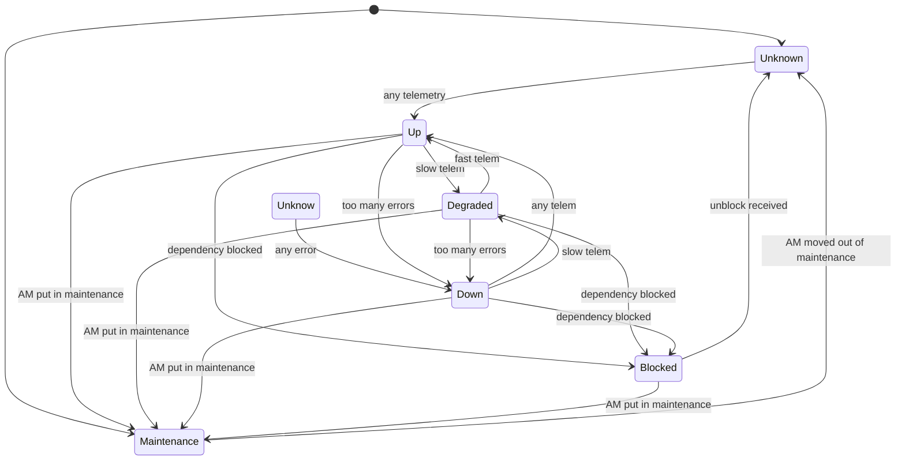

# How Stuff works

(Episode 23: Analysis)

## Introduction

We have never really written down how Analysis works, and our code base is a big pile of mostly ad-hoc rules. This
is bound to cause issues (and it is causing them, even though they're not very big). This document attempts to write
down how things work _conceptually_, so we can reason about domain logic on that level instead of digging through
code; it should help us understand the current code, think about better solutions, and drive tests.

## Terms

A quick glossary of terms:

* *Account*  A logical data grouping that usually represents a customer. Accounts are independent.
* *Monitor*  Also named "service", a grouping of data for a single API or a single vendor in the case of simple APIs. For eaxmple,
  "AWS S3", or "Braintree".
* *Check*  A single API check, often corresponding with a single API call. For example, "PutObject" in the "AWS S3" _monitor_.
* *Dependent Check*  Monitors have multiple checks, that may be dependent on each other. For example, you cannot test the performance
  of "GetObject" if "PutObject" failed.
* *Instance*  An Orchestrator instance, usually named after the location where it is running ("AWS us-east-1") but can also be a hostname
  or some other logical indicator.
* *AMCI tuple*  A coordinate of sorts to pinpoint ownership of various data items, consisting of _Account_, _Monitor_, _Check_ and
  _Instance_. Similarly, there are *AM tuples*, *AMC tuples* and *AMI tuples* for when we're only interested in a grouping of
  __AMCI_s (we will normally drop the "tuple" term).
* *Telemetry*  Incoming performance data tagged with an _AMCI tuple_.
* *Error*  Incoming information on failed runs also tagged with an AMCI tuple.
* *Status Page Check*  An element on a status page we scrape, translated into a standardized state. Also tagged with an AMCI tuple.

## Requirements

* Users need timely information at the beginning and end of issues with APIs they rely on.
* Not everybody has the same requirements when defining what an issue is. While total lack of availability is always a concern
  slow performance may be acceptable for one customer, and not acceptable for another customer.

## States

On the finest-grained level, an AMCI can have the following states for an individual check/instance:

* _Unknown_  A new check or one that just got unblocked.
* _Up_  Running as normally.
* _Down_  No API calls succeed (500 style errors).
* _Degraded_  The check is slower than normal.
* _Blocked_  The check cannot be run because it is dependent on another check that is in _Maintenance_ or _Down_.

Here is a diagram showing the allowed state transitions:

In the diagram, "slow telem" and "fast telem" stand for an incoming telemetry series that moves the running average over their
respective thresholds.

_Maintenance_ is a special state that bubbles down from (usually) the "AM" level. See the next section for details.

_Unknown_ is a special state for new or unblocked AMCIs and it signals that we simply don't know what the state is. Especially when
coming out of having been blocked, there is no good state to revert to and it makes sense to wait for at least a single telemetry or
error item to make a decision, even though that decision might be somewhat preliminary. For all practical purposes, we can treat
_Unknown_ the same as _Blocked_ with the sole execption that the AMCI now becomes runnable.

## Bubbling up states

A collection of AMCI states can form the AM, AMC and AMI states. Each of these is in principle independent and formed out of
the "lower level" states, disregarding any _Unknown_ or _Blocked_ entries:

* _Up_: everything included is _Up_.
* _Down_: everything included is _Down_.
* _Degraded_: at least one included is _Degraded_.
* _Issues_: at least one included is _Down_.
* _Maintenance_: a manually-set state for when we want to disable an AM, AMC or AMI from running. Note that maintenance bubbles down:
  putting an AM in maintenance will also put all its AMCs and AMIs in maintenance.

## Recurring checks

The same check may appear more than once in a monitoring script. By example, our current Azure CDN monitor performs the following
steps:

1. Get a file that is always in cache (as a quick test that Azure CDN is available at all).
2. Create a new file in the backing store and retrieve that
3. Purge that file from cache
4. Update the file in the backing store
5. Purge that file from cache
6. Delete the file.

"Purge" happens twice. Now, assume that "Update" fails a couple of time in an instance and so, that AMCI goes _Down_. As a result
of going _Down_ we also send the dependent check (#5) a message to become blocked, which in turn will send its dependent check (#6)
a message to become blocked.

On the level of Orchestrator, all is fine: #1, #2 and #3, and #4 will be run, the rest will be skipped until #4 comes back up
again.

On the level of Analysis, however, we don't have two "Purge" AMCIs as we combine the data, indicating that we're not really
interested in separating "purge after create" from "purge after update".

Therefore, we _must_ make sure that if we get a _Blocked_ message, that this _Blocked_ message is valid for all instances of an AMCI -
if not, as is the case here, we simply don't move the AMCI to _Blocked_ but let it remain in its current state.

## Alerting

Alerting can happen on any state transition of any AMCI, in principle. Various rules mask out certain kind of alerts and work to combine alerts, batch notifications, etc.

We will fill in this section once the state stuff has been signed off.
